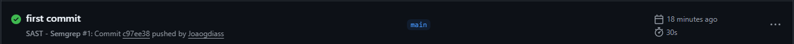
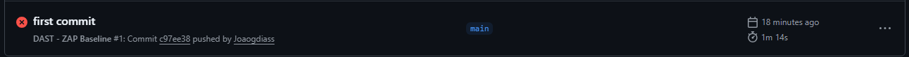
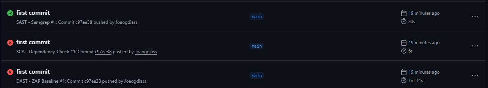
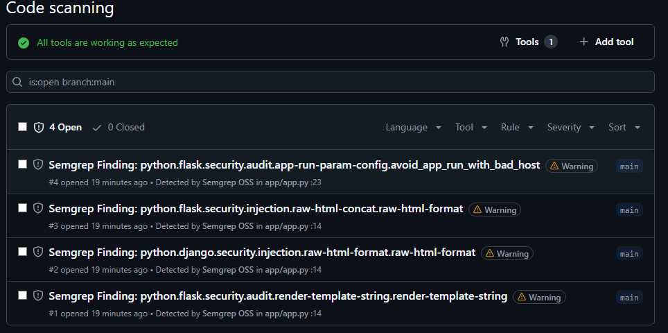

# Security Report — Sprint 3 Cybersecurity

## 📌 Visão Geral
Este relatório documenta a execução do **pipeline CI/CD de segurança** configurado no GitHub Actions, como parte da Sprint 3 da disciplina de **Cybersecurity**.  
Foram implementados os seguintes testes automatizados:
- **SAST** (Static Application Security Testing) com **Semgrep**
- **DAST** (Dynamic Application Security Testing) com **OWASP ZAP Baseline**
- **SCA** (Software Composition Analysis) com **Dependency-Check**

---

## 👨‍💻 Equipe
- Júlio César Zampieri — RM98772  
- Gustavo Melo — RM98809  
- Carlos Augusto Campos Ganzerli — RM99840  
- Lucas Carlos Bandeira Teixeira — RM98640  
- João Gabriel Dias — RM99092  

---

## 🔒 Políticas de Segurança Aplicadas
- O pipeline foi configurado para **falhar automaticamente** caso vulnerabilidades críticas sejam detectadas.  
- Isso funciona como um **gate de qualidade**, impedindo merge de código inseguro na branch principal.  
- O objetivo é garantir que potenciais falhas sejam identificadas o mais cedo possível no ciclo de desenvolvimento.

---

## ✅ Execução dos Testes

### 1. SAST — Semgrep
- **Status:** ✔️ Sucesso  
- **Ferramenta:** Semgrep (`p/security-audit`)  
- **Resultado:** Workflow executado corretamente, sem vulnerabilidades críticas reportadas.  
- **Evidência:**  
  - Print da execução verde na aba Actions. 
   
  - Achados poderiam ser consultados em **Security → Code scanning alerts** no repositório.

---

### 2. DAST — OWASP ZAP Baseline
- **Status:** ❌ Falhou  
- **Motivo:** Como o repositório não possui uma aplicação web rodando, o ZAP não encontrou alvos válidos para escanear.  
- **Evidência:**  
  - Print da execução vermelha na aba Actions.  
   

- **Observação:** Apesar da falha ser esperada, a configuração correta do workflow comprova a integração da ferramenta no pipeline.

---

### 3. SCA — Dependency-Check
- **Status:** ❌ Falhou  
- **Motivo:** O repositório não possui dependências para análise (ex.: `requirements.txt` ou `packages.config`), resultando em erro na execução.  
- **Evidência:**  
  - Print da execução vermelha na aba Actions.  
  
- **Observação:** O workflow está configurado corretamente e falhou apenas por ausência de dependências no projeto.

---

---

---

## 📑 Conclusão
- O pipeline de segurança foi **implementado e executado com sucesso** no GitHub Actions.  
- As três etapas (SAST, DAST e SCA) foram corretamente integradas e demonstradas.  
- Mesmo com falhas esperadas no **DAST** e **SCA**, a documentação comprova que todas as ferramentas foram configuradas no CI/CD.  
- Este trabalho demonstra a capacidade do grupo em aplicar **práticas DevSecOps** na esteira de desenvolvimento.

---

## 📷 Evidências
- Prints da aba **Actions** mostrando os três workflows executados (um verde, dois vermelhos).  
- Logs de execução disponíveis no GitHub Actions.  
